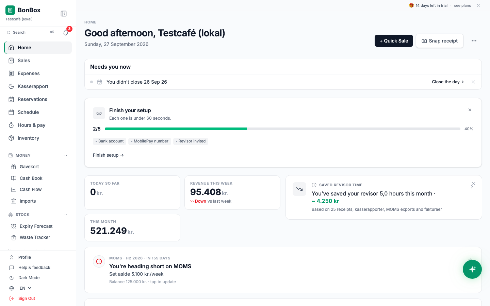
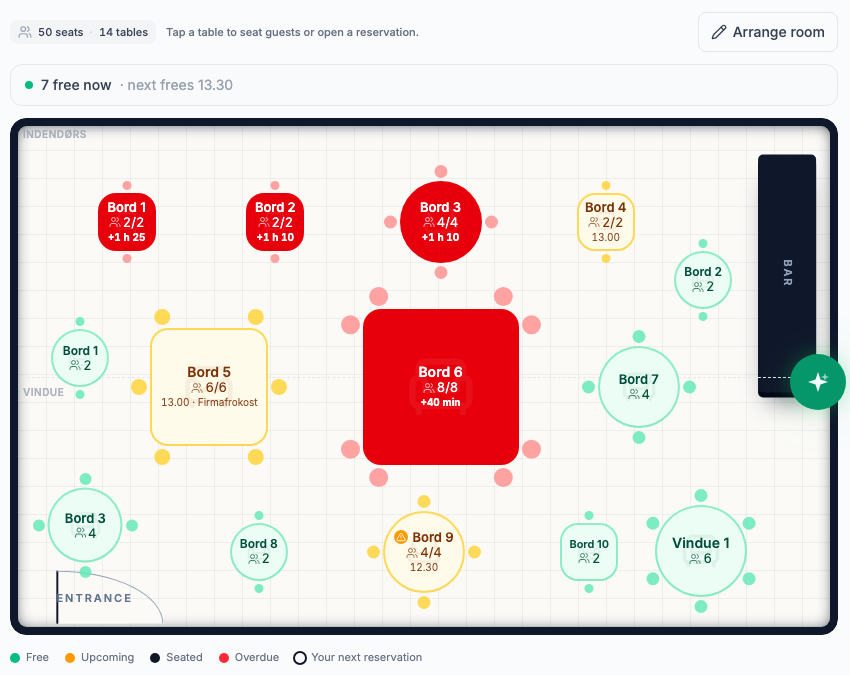
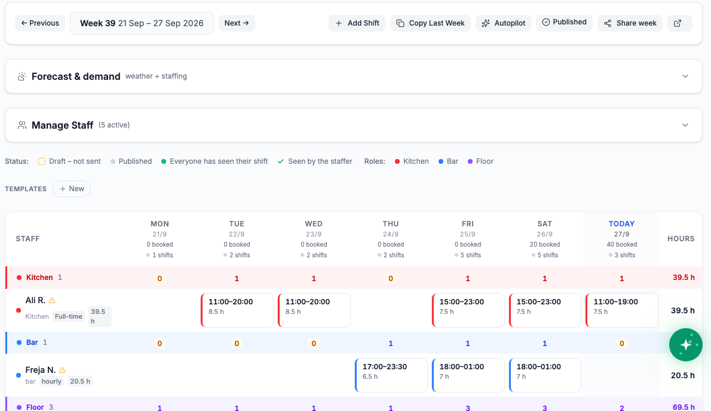
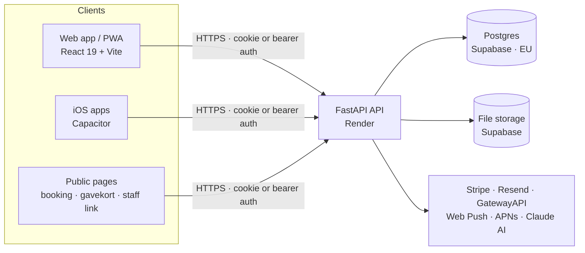

# BonBox

**One app for the back office of a small Danish business.**

BonBox gives an owner-operated restaurant, café, bar, salon or shop one place
for the six jobs that fill the back office: closing the till, taking bookings,
planning staff, tracking hours, watching stock, and keeping the money straight
for MOMS and the revisor. It is built for Denmark first — kasserapport, MOMS,
faktura and gavekort are used as the Danish terms they are — and the whole
product works in Danish and English.

- **Live:** [bonbox.dk](https://www.bonbox.dk) · API `api.bonbox.dk`
- **Apps:** web (installable PWA) and iOS — an owner app and a staff app

<p align="center">
  
</p>
<table>
  <tr>
    <td width="50%"></td>
    <td width="50%"></td>
  </tr>
</table>
<sub>Screenshots from a local demo venue with made-up data.</sub>

## What it does

| Job | In the product |
|---|---|
| **Daily close** | Kasserapport: snap the Z-report or type the numbers, confirm, and the day is locked as the figures MOMS is built on; PDF for the revisor |
| **Reservations** | Booking book, floor plan, timeline, waitlist, a host-stand device, and a public booking page for the venue's own website |
| **Schedule** | Weekly rota (Vagtplan) with templates, Autopilot, copy-last-week and labour cost, plus a staff app for shifts, swaps and chat |
| **Hours** | Punch clock with an optional location lock, hours review, lønseddel PDF for the revisor |
| **Stock** | Inventory counts, low-stock levels, expiry forecast and waste tracking |
| **Money** | Sales and expenses, receipt scanning, faktura, gavekort, cash book, cash-flow forecast, MOMS overview |

## Architecture



- **Frontend** — React 19, Vite 8, Tailwind CSS 4, React Router 7. Deployed on
  Vercel. Each language is its own chunk, loaded on demand.
- **Backend** — Python 3.13, FastAPI, SQLAlchemy 2, Pydantic 2. Deployed on
  Render; schema migrations run on startup
  ([ADR-001](docs/decisions/001-auto-migrations.md)).
- **Data** — Postgres on Supabase (EU region). Data is scoped to the owner's
  account; public pages use signed or per-link tokens.
- **Services** — Stripe (billing), Resend (email), GatewayAPI (SMS), Web Push
  and APNs (notifications), Claude (AI features, optional).

## Repository layout

```
smallbiz-dashboard/
├── backend/       FastAPI app (routers · models · services · jobs) and its tests
├── frontend/      React app, native shells (ios/, android/) and its tests
├── docs/          architecture, decisions, specs, research, runbooks — see docs/README.md
├── scripts/       repository checks and the pre-commit hook
├── STRUCTURE.md   where everything lives, feature by feature
└── CLAUDE.md      conventions and rules for working in this repo
```

The full map, with a "where do I find…?" table, is
[`STRUCTURE.md`](STRUCTURE.md). All documentation is indexed in
[`docs/README.md`](docs/README.md).

## Running it locally

Backend (Python 3.13):

```bash
cd backend
python3.13 -m venv venv
venv/bin/pip install -r requirements.txt
DATABASE_URL=sqlite:///./smallbiz.db venv/bin/uvicorn app.main:app --reload --port 8000
```

Frontend (Node 20.19+ or 22.12+):

```bash
cd frontend
npm install
npm run dev            # http://localhost:5173, talks to the API on :8000
```

## Quality

| Check | How |
|---|---|
| Backend tests (~4,300, pytest) | `backend/venv/bin/python -m pytest backend/tests -q` |
| Frontend tests (~1,650, Vitest) | `cd frontend && npx vitest run` |
| Lint | `cd frontend && npm run lint` |
| Translations — every key in English and Danish, Danish accounting terms locked | `cd frontend && npm run lint:i18n` |

The pre-commit hook ([`scripts/pre-commit`](scripts/pre-commit); install with
`ln -s ../../scripts/pre-commit .git/hooks/pre-commit`) blocks a commit that
breaks the migration pattern, calls a translation key that does not exist,
duplicates a key, translates a locked Danish term, references an undefined
name, or adds a background job that writes money without an audit row and
an undo.

Security is treated as a feature: data scoped per account, CSRF protection,
rate limits on public endpoints, PIN-protected staff links, audit logs for
money and access, and GDPR data export and erasure.

## Status

In production with Danish venues.
